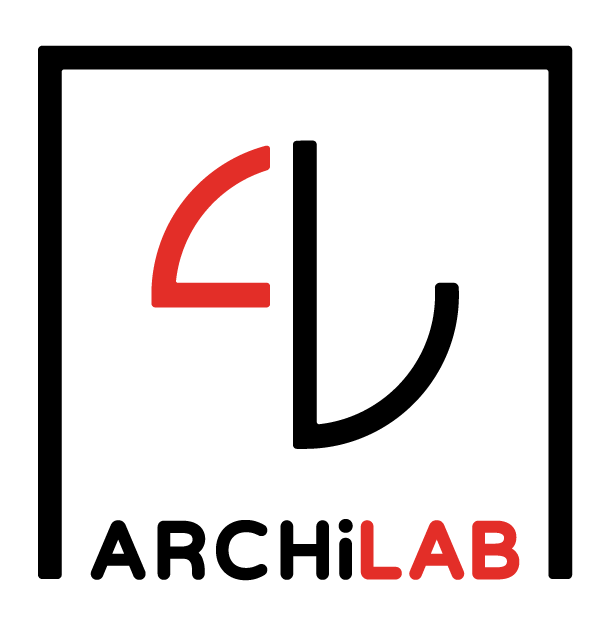

# ArchiLab - HEG Genève

  

## À propos

**ArchiLab** est le premier laboratoire suisse romand dédié à la recherche appliquée en archivistique, basé à la [Haute École de Gestion de Genève (HEG-GE)](https://www.hesge.ch/heg/), membre de la [HES-SO](https://www.hes-so.ch/).

### Notre Mission

Moderniser les pratiques archivistiques en intégrant les technologies d'intelligence artificielle avancées, tout en préservant les principes fondamentaux de la science archivistique.

### Axes de Recherche

- **Intelligence Artificielle pour les archives** : RAG, GraphRAG, systèmes multi-agents
- **Technologies sémantiques** : RDF, Linked Open Data, ontologies
- **Science archivistique computationnelle** : automatisation, numérisation intelligente
- **Accès et valorisation** : interfaces conversationnelles, multilinguisme

---

## Projet Phare : Ask_ArchiLab

  

**Ask_ArchiLab** est un système d'IA conversationnel innovant conçu pour moderniser l'accès aux connaissances archivistiques.

### Caractéristiques principales

| Fonctionnalité | Description |
|----------------|-------------|
|  **IA Conversationnelle** | Interface conversationnelles pour interroger les ressources archivistiques |
|  **Multi-sources** | Intégration ICA, PIAF, InterPARES Trust |
|  **Multilingue** | Support français, anglais |
|  **Sémantique** | Technologies RDF et Linked Open Data |
|  **RAG Avancé** | Retrieval-Augmented Generation pour des réponses précises |

### Public cible

-  Professeurs et formateurs en archivistique
-  Archivistes professionnels
-  Étudiants en sciences de l'information
-  Chercheurs en patrimoine culturel
-  Généalogistes et passionnés d'histoire

---

## Partenaires

  
  
  
  

---

## Équipe

| Rôle | Nom | Institution |
|------|-----|-------------|
| **Direction scientifique** | Pr. Dr. Basma Makhlouf Shabou | HEG-Genève |
| **Recherche IA** | Dr. Lamia Friha | Université de Genève |
| **Assistante de recherche / PhD** | Aïchatou | HEG-Genève |
| **Développement** | Wassila Ramli | Contexa SA / UNIGE |
| **Conseil technique** | Pierre-Yves Burgi | Université de Genève |

---

## Repositories

| Repository | Description | Status |
|------------|-------------|--------|
| [Ask_ArchiLab](https://github.com/ArchiLab-HEG/Ask_ArchiLab) | Système principal - Assistant IA conversationnel | 🟢 Actif |
| [Ask_ArchiLab_Data](https://github.com/ArchiLab-HEG/Ask_ArchiLab_Data) | Pipelines d'extraction et corpus structurés | 🟢 Actif |

---

##  Publications & Présentations

- **IEEE Big Data 2025** : "Developing a Smart Archival Assistant with Conversational Features and Linguistic Abilities: the Ask_ArchiLab Initiative"
- [ Démonstration Ask_ArchiLab](https://www.youtube.com/watch?v=NNoAd_HMDRM)

---

## Contact

- **Web** : [ArchiLab @ HEG-Genève](https://www.hesge.ch/heg/recherche/recherche-appliquee/archilab)
- **Email** : archilab.heg@hesge.ch
- **Localisation** : Geneva, Switzerland 🇨🇭

---

  © 2025 ArchiLab - HEG Genève | HES-SO

